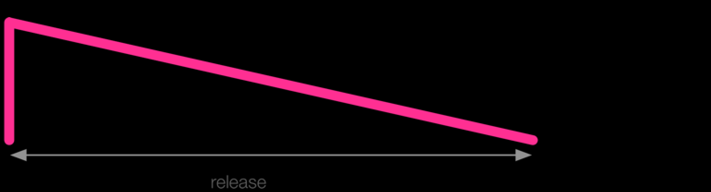
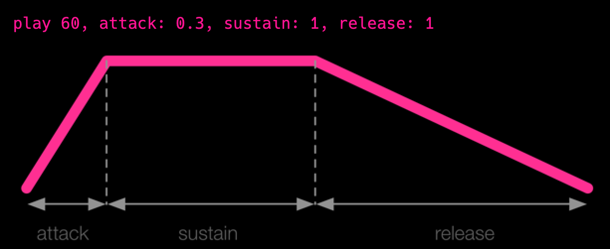
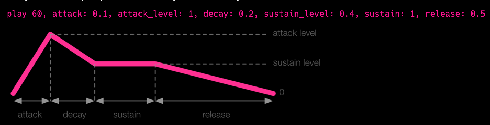

# Synths
los envelopes me dicen como debo de controlar el sonido, es como decirle a alguien cuando subir el volumen de la guitarra, que tan rápido, etc…

la opción de **release** me dice cuanto puede durar el sonido,



sustain me dice cuanto tiempo sostengo el sonido entre el ataque, el el release



sirve para darle precencia en la mezcla, se puede poner el ataque y el release en 0, lo que causaria un sonido sin "fade in" ni "fade out", pero puede producir clicks, en el audio, se recomienda usar valores cortos

el decay es el tiempo entre el ataque y el sustain, y me dice cuanto va a caer del `attack_level` al  `decay_level`, que por defecto tendra el sustain level 



básicamente, con estos parametros puedo jugar bastante con las ondas


1. attack - time from 0 amplitude to the attack_level, 
2. decay - time to move amplitude from attack_level to decay_level, 
3. sustain - time to move the amplitude from decay_level to sustain_level, 
4. release - time to move amplitude from sustain_level to 0 

los niveles a los que pueden llegar ya estan preconfigurados. la duracion del sonido es la suma de 3 fases

`play 60, attack: 0.5, decay: 1, sustain: 2, release: 0.5` con una duracion total de  `0.5 + 1 + 2 + 0.5 = 4` 

# Samples
el `sleep` solo describe cuanto se separa un sonido del otro, no  la duracion, es decir que si el sample dura mas que el sleep se va a sobreponer

los samples son sonidos pregrabados como numeros que dicen como mover el cono de sonido para reproducirlo (nunca habia pensado en esto la verdad), para reproducir el sonido lo mas fiel posible, se necesitan guardar muchos por segundo

* Rate: lo podemos ver como un resorte, si le ponemos 2 estamos comprimiendo el resorte a la mitad, si le ponemos menos de 1, lo estamos alargando, esta transformacion conlleva a que se modifique la densidad del resorte (numero de alambres por cm) y en el sonido se traduce a una modificación del pitch, entre mas lo 'precione' mayor será el pitch, y viceversa

## math behind
un sample es si no una lista de numeros que me dice en donde se deberia encontrar el speaker en determinado momento del tiempo


cuando pongo un rate menor que 1 básicamente estoy dividiendo el `waveform`


adsr significa, ataque, decay, sustain y release, y los samples a diferencia de los sintentizadores, solo se puede recortar el tiempo mas no alargarlo, según el sample sonic pi automagicamente calcula el valor del sustain. el release trabaja desde el final del sample haste el inicio

digamos si el track dura `1.75s` y le doy un ataque de `0.75s` y un release de `0.75s`
el sustain deberia de ser calculad a `0.25s` 

puedo setear el sustain a `0` y el track solo sonará lo que tenga el ataque y el release

támbien podemos decidir donde queremos que inicie o termine nuestro sample, donde 0 es el inicio y 1 el final, si combino bien los parametros, me puede reversar el sample

`rrand` retorna un valor entre dos valores excusivamente, es decir que no incluye los extremos

`rrand_i` retorna un valor entre los dos incluyendolos

`one_in` sirve bastante para los valores de verdadero o falso, me dice la probabilidad de que ocurra un evento `one_in(2)` es casi como tirar una moneda

los hilos nombrados solo existen una vez. no se pueden duplicar.

se puede capturan en variables el resultado de llamar a play y sample,

como muchos lenguajes de programacion, las variables globales que se modifican no se deben de modificar en el mismo thread por que se dan condiciones de carrera, aunque algunas cosas si las queramos compartir como el bpm el synth, y de igual forma se nos provee con el mecanismo para modificarlas usando `get` y `set`


el parametro `phase` me dice cuanto puede durar un efecto, entocnces si lo pongo bajito como `0.125` sonará rapido, cuando se anidan los efectos son aplicados desde lo mas interno a lo mas externo	

effects can be manipulated with the `|r|` goalpost option 

scales and chords are great to be playing randomly to explore

los live_loops generan un evento cue que sirve para syncronizarse. cue y sync es un wrapper sobre el time state

podemos crear cues de strings y hacer pattern matching sobre los mismos.
ejemplo: `sync "/*/*/*"` sincronizaria con cualquier patron que genere evento `cue`
como lo sgte  `cue "/foo/bar/baz"`

para crear un audio perpetuo de una entrada utilizamos `live_audio :foo` puedo tener multiples live loops llamando ese live audio y se va a cambiar el contexto automaticamente


https://github.com/binarysweets/sonic-pi-monthly-challenge/tree/main/challenge-1

lo que me permite diferenciar que el sonido venga de una guitarra o de un piano es el timbre

:r representa rest o silencio


using rate on a drum samples cretes different types of drum 

```ruby
live_loop :drums do
  use_random_seed 2001
  16.times do
    r = rrand(0.5, 10)
    sample :drum_bass_hard, rate: 50, amp: rand
    sleep 0.125
  end
  
end
```

## Controlling your sound tutorial
Los synths devuelven cosas llamadas SynthNode que representa un sonido que se emite
el `cutoff_slide` me dice que tan rapido me voy a mover a la proxima nota, es basicamente como si tocara una tecla y deslizara el dedo hasta llegar a la otra
támbien se puede utilizar en los `FX`

## Amplitude Modulation

```ruby
with_fx :slicer, phase: 0.125 do
  sample :loop_mika
end
```

esto puede crear nuevos ritmo de un tambor hay que ser concientes que el phase funciona por beat, por lo cual para que suene coherente, debemos hacer algo como

`use_sample_bpm :the_drum_sampe`


### Five live coding tecniques 
si se usa sync en un live loop se puede uno recuperar del error por que dependera de la señal que el otro le envie

es mas importante hacer sonidos que no nos gustan que hacer sonidos que nos gusten

reversar el codigo en la mente, es decir, poder leerlo e imaginarnos como va a sonar,

es importante saber que existe un main mixer que afectara todos los sonidos

`set_mixer_control! lpf: 50 `
`reset_mixer!` -> para resetearlo

### Sampling streching
jugar con el rate del sample sube y baja el pitch, doblar el rate resulta en el pitch siendo una octava mas grande, y
el resultado inverso bajando el rate

### Additive Synthesis
tal cual como mezclar las pinturas, si mezclamos muchos colores, va a resultar siendo un marron (: 
